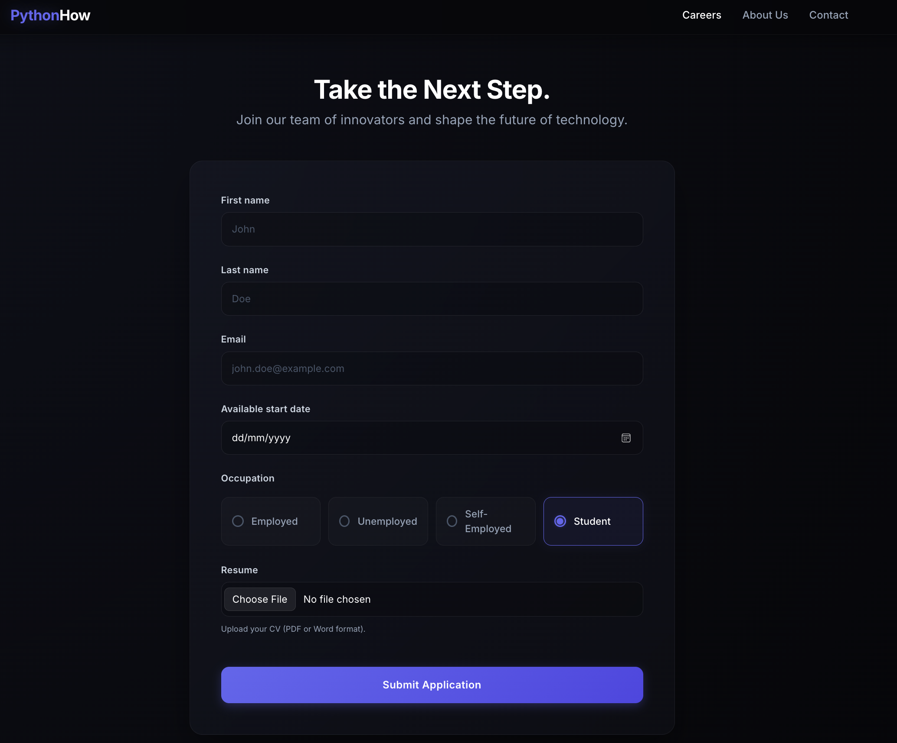
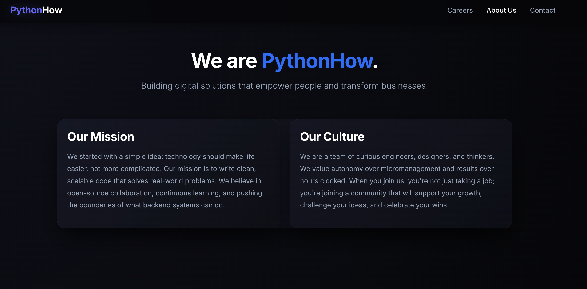
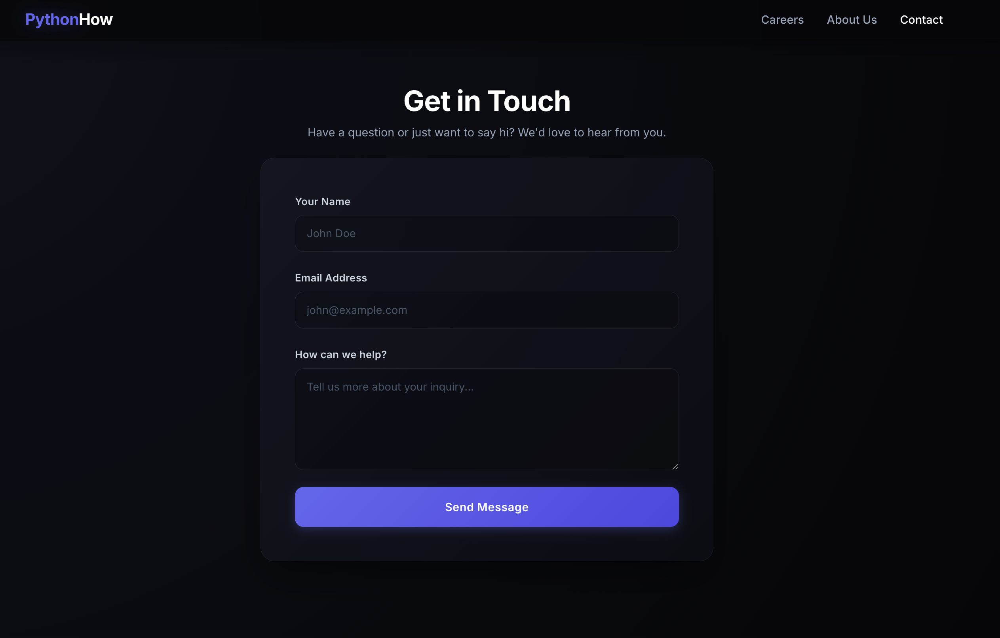
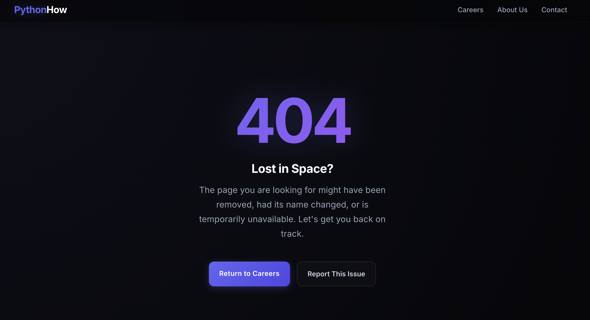
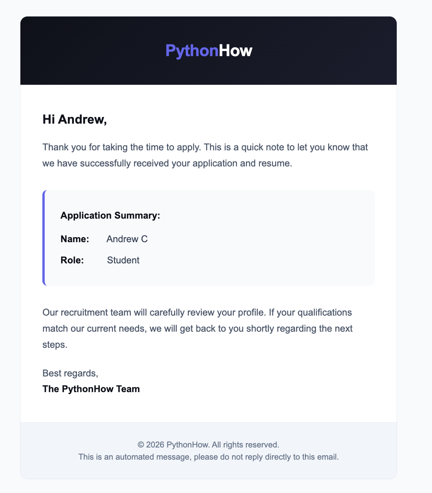
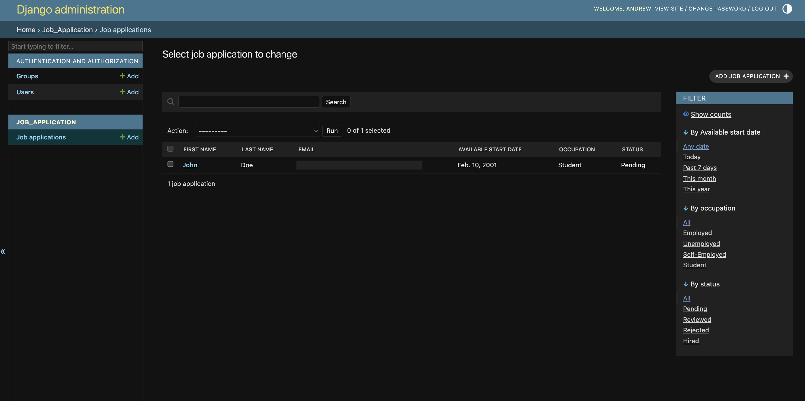
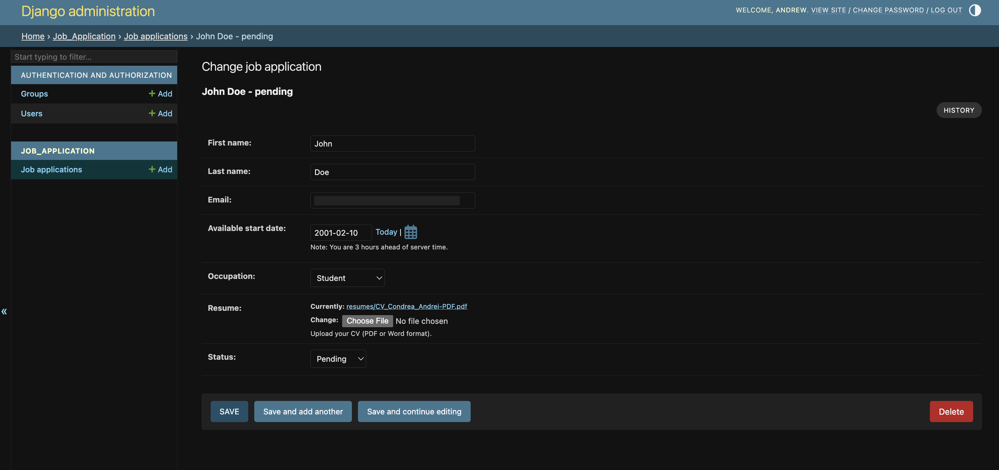

<div align="center">

  <h1>🚀 Django Job Application Portal</h1>

  <p>
    A sleek, modern <strong>web application</strong> for managing career opportunities and processing job applications.<br />
    Built with <strong>Django</strong> — featuring automated email confirmations, an admin dashboard with CSV exports, and a glassmorphism dark UI.
  </p>

  <p>
    
    
    
    
  </p>

</div>

<br />

---

## 📸 Screenshots

<div align="center">
    
    <br /><br />
    
  &nbsp;&nbsp;
    
    
    
    
    


</div>

<br />

---

## ✨ Features

* **💼 Seamless Application Flow:** Users can submit their details, select their current occupation via custom interactive radio tiles, and upload their resumes (PDF, DOC, DOCX).
* **✉️ Automated Email Notifications:** Sends a beautifully styled HTML confirmation email to applicants immediately upon submission using Django's core mail modules.
* **🛡️ Smart Form Validation:** Custom clean methods prevent users from submitting duplicate applications within a 30-day window and validate file extensions before uploading.
* **📊 Admin Dashboard & Export:** Fully customized Django admin interface to track application statuses (Pending, Reviewed, Rejected, Hired) with a one-click **Export to CSV** action for HR teams.
* **🎨 Premium UI/UX:** A bespoke glassmorphism dark theme utilizing Bootstrap 5, complete with custom inputs, hover glows, and a responsive layout.
* **🔒 Secure Configuration:** Sensitive credentials (secret key, SMTP passwords) are strictly managed via environment variables using `python-dotenv`.

---

## 🛠️ Tech Stack

* **Backend:** Python, Django 6.0
* **Frontend:** HTML5, CSS3, Bootstrap 5
* **Database:** SQLite (Default, scalable to PostgreSQL)
* **Static File Management:** WhiteNoise
* **Environment Management:** python-dotenv

---

## 🚀 Getting Started

Follow these instructions to get a local copy up and running for development and testing.

### Prerequisites

* Python 3.10+
* Git

### Installation

1. **Clone the repository:**
    ```bash
    git clone [https://github.com/YourUsername/Django-Form.git](https://github.com/YourUsername/Django-Form.git)
    cd Django-Form
    ```

2. **Create and activate a virtual environment:**
    ```bash
    # Windows
    python -m venv venv
    venv\Scripts\activate

    # macOS/Linux
    python3 -m venv venv
    source venv/bin/activate
    ```

3. **Install the dependencies:**
    ```bash
    pip install -r requirements.txt
    ```

4. **Environment Setup:**
    Create a `.env` file in the root directory (alongside `manage.py`) and configure your secrets:
    ```ini
    SECRET_KEY=your_django_secret_key_here
    EMAIL=your_smtp_email@gmail.com
    PASSWORD=your_app_specific_password
    ```

5. **Run Database Migrations:**
    ```bash
    python manage.py makemigrations
    python manage.py migrate
    ```

6. **Create a Superuser (for Admin Dashboard access):**
    ```bash
    python manage.py createsuperuser
    ```

7. **Start the Development Server:**
    ```bash
    python manage.py runserver
    ```
    Navigate to `http://127.0.0.1:8000` to view the app, and `http://127.0.0.1:8000/admin` to access the HR dashboard.

---

## 📬 Contact

* **Name:** Andrei Condrea
* **LinkedIn:** [Andrei Condrea](https://www.linkedin.com/in/andrei-condrea-b32148346)
* **Email:** condrea.andrey777@gmail.com

<p align="center">
  <i>"Building digital solutions that empower people and transform businesses."</i>
</p>